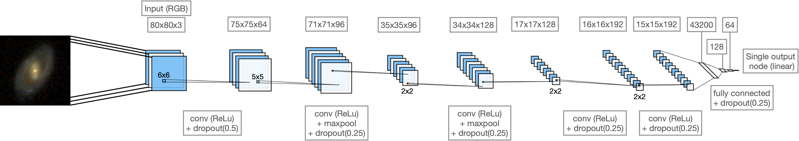

# sdss_CNN

Deep convolutional neural network for predicting a galaxy's spin based on SDSS photometry (RGB images).

This directory using kinematic information from [MaNGA](https://www.sdss.org/surveys/manga/), along with photometry from the Sloan Digital Sky Survey ([SDSS](https://classic.sdss.org/dr7/)), to train a convolutional neural network (CNN) to predict a galaxy's spin. MaNGA observations (resulting in kinematic information) are expensive and hence we only have 1000s of galaxies with estimated spin values (at least computed directly from kinematics). On the other hand, we have millions of SDSS galaxy images, so extrapolating kinematic properties would be useful.

## Data

### MaNGA 
MaNGA data is taken from the Data Analysis Pipeline ([DAP](https://www.sdss.org/dr15/manga/manga-analysis-pipeline/)) which provides stellar and (ionized) gas velocity fields. Velocity fields are found by fitting the stellar continuum, from which the spin parameter λR is estimated. λR [introduced here](https://arxiv.org/abs/astro-ph/0703531) is a measure of _spin_ for a galaxy, by computing the light weighted average of ordered rotation divided by dispersion (random motion). 

### SDSS photometry (i.e. RGB image)
SDSS has created the most detailed three-dimensional maps of the Universe (_so far_) with deep multi-color images of galaxies covering one third of the sky. The vast majority of MaNGA galaxies have been imaged by SDSS, which we can use as input into our convolutional neural network. The exact resolution of an image (relative to the galaxy size) is variable (since it is dependent on the distance to the galaxy). 

Galaxy images are pulled from the SDSS database on [sciserver](https://www.sciserver.org/) see in `./data/on_sciserver/`. Each image downloaded is 424 x 424 pixels in size where each pixel is set to be 0.02Re (elliptical petrosian half-light radius) of the target galaxy (i.e. image covers 8.48Re for each galaxy). 

### Pre-processing for CNN
For input into the CNN, we downsample all galaxy images to be size (80, 80, 3) (to avoid fitting noise), and, normalised so pixel values (in each channel) range [0, 1]. We have 6437 galaxies, both with SDSS images and MaNGA kinematic information which we use to train, validate, and, test our network. We split (70, 15, 15)% so that:

| Sample  | Count |
| ------------- | ------------- |
| Training | 4505 |
| Test | 966 |
| Validation | 966 |

Galaxy images are augmented for the training sample, where during each epoch of the training images are randomly zoomed (±25%), rotated (±45 degrees), flipped (both horizontally and vertically), and, shifted both vertically and horizontally (by 5%). 

## CNN

### Architecture

For a schematic of the CNN see `./plots/cnn_schematic.png` (or in the banner of this readme). The neural network consists of :

- 5 convolutional layers 
  - number of filters : 64, 96, 128, 192, 192
  - kernel size : 6x6, 5x5, 2x2, 2x2, 2x2
  - dropout : 0.5, 0.25, 0.25, 0.25, 0.25
  - ReLu activations
  - MaxPooling after the second and third convolutional layers

- Flattening and 3 fully connected hidden layers 
  - numer of nodes : 43200, 128, 64
  - dropout : 0.25 (after second only)
  - activations : Linear, ReLu, Linear

- Output node with linear activation (i.e. for regression to predict value in [0, 1] range.

This leaves 5,994,145 parameters that are optimised in the model training.

### Model hyperparameters

Basic tuning (by hand) was first implemented to build the rough model architecture (i.e. number of hidden layers and select a sensible initial learning rate). Further hyperparameter tuning (using [`keras-tuner`](https://keras-team.github.io/keras-tuner/) was then implemented to select filter size in each of the convolutional layers and associated dropout. Batch-Normalisation was found _here_ to decrease performance when implemented in tandem with dropout. 

Hyperparameters : 
- Learning rate : η=0.001 with ADAM optimiser (i.e. with its own flavour of momentum) which reduces on plateau (patience=5) to be 0.2 of the previous LR to a minimum value of η=0.00001.
- Loss : Mean squared error
- Epochs : 

### Model evaluation 
